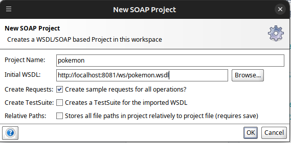
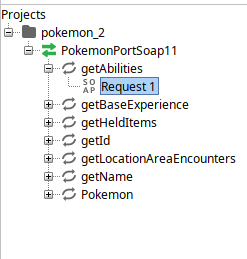
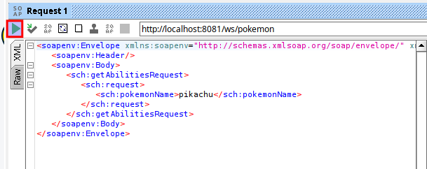
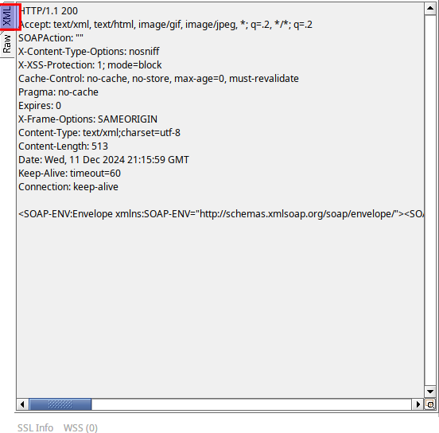
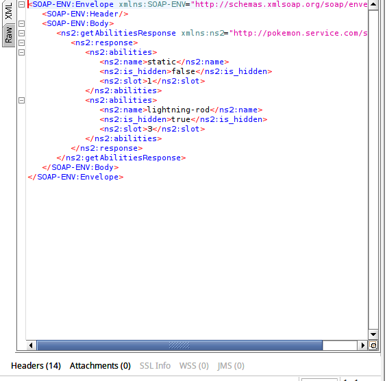
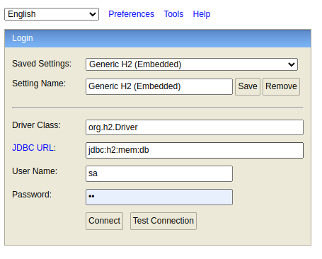
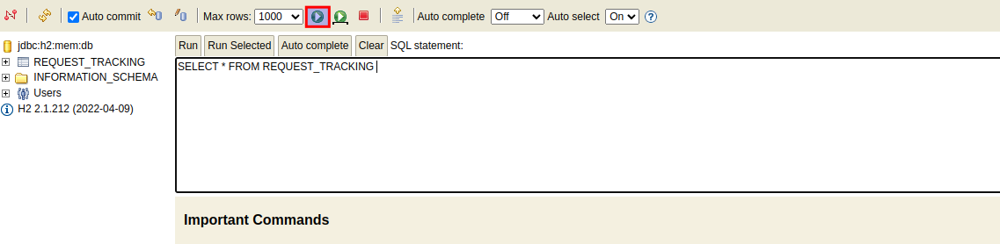
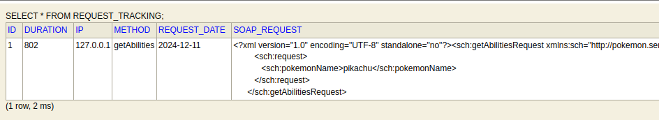

# bancaya - challenge

El servicio es una aplicacion springboot la cual utliza una base de datos en memoria H2 para guardar
campos solicitados en el documento.

### Validacion de Servicios

1. Obtener el wsdl se accede a la siguiente URL

```bash
    http://localhost:8081/ws/pokemon.wsdl
```

2. Usar SOAP GUI para autogenerar el set de pruebas, File/New SOAP Project y 
llenar los campos como se muestra a continuacion




3. Desplegar el arbol de test y seleccionar el apartado de Request como se muestra
en la imagen



4. Hacer doble click para abrir la edicion de request, poner el nombre del pokemon que se 
desea consultar, cambiando el ? por el nombre del pokemon, y dar click en el boton de Play 
resaltado con rojo en la imagen.



5. Validar la respuesta del servicio haciendo click en la seccion de la izquierda en la pestania
XML como se muestra en la imagen




6. Ejemplo de response body




## Validacion de persistencia de requests


1. Entrar a la siguiente URL

```bash
http://localhost:8081/h2-console

```
2. Poner los siguientes valores en la credenciales de acceso y JDBC URL



3. Seleccionar tabla a consultar y hacer click en el boton resaltado en la imagen



4. Validar datos solicitados para su persistencia

